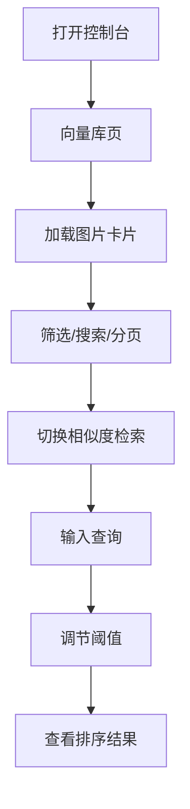

# Agentic Image RAG 控制台

## 1. 产品概述

面向地理遥感图像知识库的 Web 管理控制台，提供已入库图片向量的可视化浏览与语义相似度检索能力，帮助研究人员高效管理和分析 T1/T2 双时间点多模态图像数据。

## 2. 核心功能

### 2.1 功能模块

1. **向量库浏览**：以卡片网格展示已入库图片，显示图片预览、ID、来源（T1/T2）、存储时间、描述文本
2. **相似度检索**：上传参考图片或输入文本查询，调节相似度阈值，查看按相似度排序的返回结果

### 2.2 页面详情

| 页面名称 | 模块名称 | 功能描述 |
|---------|---------|---------|
| 向量库 | 图片卡片网格 | 瀑布流/网格展示图片，带来源标签和描述 |
| 向量库 | 筛选工具栏 | 按来源（T1/T2）筛选、关键词搜索、分页 |
| 相似度检索 | 查询输入区 | 支持文本输入或图片上传作为参考 |
| 相似度检索 | 阈值滑块 | 0-1 连续调节，实时更新结果 |
| 相似度检索 | 结果列表 | 按相似度分数降序排列，带分数条可视化 |

## 3. 核心流程

用户打开控制台 → 默认进入向量库页面，加载图片卡片 → 可筛选/搜索/分页浏览 → 切换至相似度检索页 → 输入查询 → 调节阈值 → 查看排序结果

## 4. 用户界面设计

### 4.1 设计风格

- **主色调**：深 slate 底色 (#0f172a) + 青蓝强调色 (#38bdf8)
- **辅助色**：T1 用琥珀橙 (#f59e0b)、T2 用翠绿 (#34d399)
- **按钮**：直角微圆 (4px)，主按钮带青蓝渐变边框
- **字体**：显示字体使用 "JetBrains Mono"，正文使用 "Noto Sans SC"
- **布局**：顶部固定导航栏 + 左侧功能选项卡 + 主内容区
- **图标**：lucide-react 线性图标

### 4.2 页面设计概述

| 页面 | 模块 | UI 元素 |
|-----|------|---------|
| 全局 | 导航栏 | 深色背景，左侧 Logo，右侧状态指示 |
| 全局 | 侧边选项卡 | 垂直排列，图标+文字，激活态带左侧青蓝指示条 |
| 向量库 | 工具栏 | 来源筛选 pills、搜索输入框、视图切换（网格/列表） |
| 向量库 | 图片网格 | 3-4 列响应式卡片，hover 浮起阴影，图片上方来源标签 |
| 向量库 | 分页 | 居中页码 + 每页数量选择器 |
| 相似度检索 | 查询区 | 文本输入框 + 图片上传拖拽区（二选一） |
| 相似度检索 | 阈值控制 | 水平滑块，当前值数字显示，0-1 精度 0.01 |
| 相似度检索 | 结果区 | 左侧结果卡片（缩略图+分数条），右侧空或选中详情 |

### 4.3 响应式设计

- 桌面端：左侧固定 200px 侧边栏，主内容区自适应
- 平板：侧边栏收缩为图标栏，点击展开
- 移动端：底部 Tab 导航替代侧边栏，单列卡片

### 4.4 动效

- 页面切换：内容区淡入滑动 (200ms ease-out)
- 卡片加载：stagger 上浮动画，每张间隔 50ms
- 搜索加载：骨架屏脉冲 shimmer 效果
- 相似度分数条：宽度从 0 动画到目标值 (500ms cubic-bezier)
