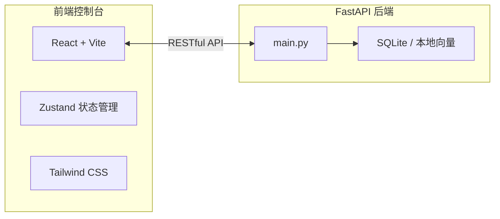

## 1. 架构设计



## 2. 技术选型

* **前端框架**：React 18 + TypeScript

* **构建工具**：Vite

* **样式方案**：Tailwind CSS 3

* **状态管理**：Zustand

* **图标库**：lucide-react

* **HTTP 客户端**：原生 fetch

* **初始化模板**：react-ts

## 3. 路由定义

| 路由       | 用途            |
| -------- | ------------- |
| /        | 重定向至 /vectors |
| /vectors | 向量库浏览页        |
| /search  | 相似度检索页        |

## 4. API 定义

基于现有 FastAPI 后端，新增以下接口供前端调用：

```typescript
// 获取图片列表
GET /api/v1/images?page={number}&size={number}&source={t1|t2|null}&q={string}
Response: {
  total: number;
  page: number;
  size: number;
  items: Array<{
    id: string;
    object_key: string;
    source: string;
    caption: string;
    created_at: string;
    preview_url: string;
  }>;
}

// 相似度检索
POST /api/v1/search
Body: {
  query?: string;        // 文本查询
  image_path?: string;   // 参考图片路径（上传后返回）
  threshold?: number;    // 阈值 0-1
  source?: "t1" | "t2" | null;
  limit?: number;
}
Response: {
  results: Array<{
    id: string;
    object_key: string;
    source: string;
    caption: string;
    score: number;
    preview_url: string;
  }>;
}

// 图片上传（用于相似度检索参考图）
POST /api/v1/upload
Body: multipart/form-data (file)
Response: { path: string }
```

## 5. 数据模型

前端状态结构（Zustand）：

```typescript
interface AppState {
  // 向量库
  images: ImageItem[];
  totalImages: number;
  imagesLoading: boolean;
  imagesError: string | null;
  filters: {
    source: "t1" | "t2" | null;
    query: string;
    page: number;
    size: number;
  };

  // 相似度检索
  searchResults: SearchResult[];
  searchLoading: boolean;
  searchError: string | null;
  searchParams: {
    query: string;
    threshold: number;
    source: "t1" | "t2" | null;
    referenceImage: File | null;
  };

  // Actions
  fetchImages: () => Promise<void>;
  searchSimilar: () => Promise<void>;
  setFilter: (key: string, value: any) => void;
  setSearchParam: (key: string, value: any) => void;
}
```

